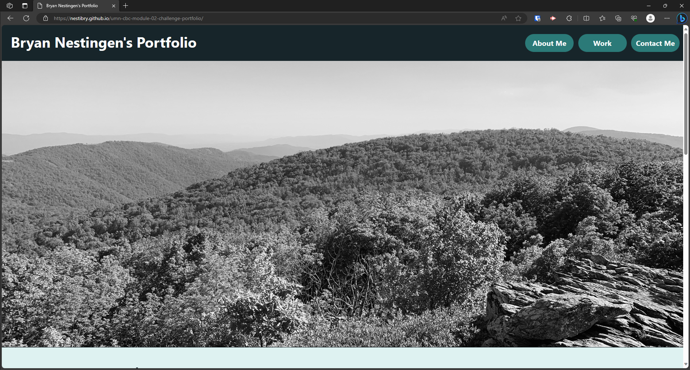
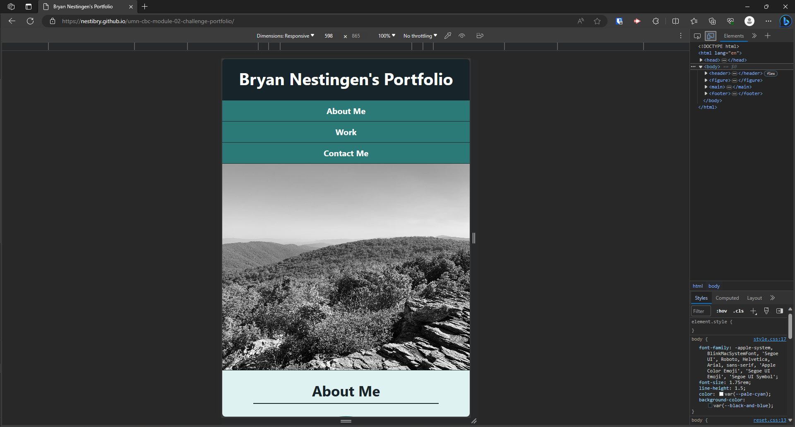

# Module 2 Challenge - My First Portfolio
*University of Minnesota - Coding Boot Camp*

## Description

Designing and developing my first profession portfolio using HTML and CSS.

- Setup codebase to use semanitic HTML element tags
- Utlized CSS Flexbox to style webpage elements for a responsive layout that adapts to the user's viewport
- Portfolio includes a brief summary about me, my work projects, and my contact info 

## Installation

N/A

## Usage

https://nestibry.github.io/umnbc-mod02-challenge-portfolio/

## Credits
Color schemes sourced from [VISME](https://visme.co/blog/website-color-schemes/). The color pallete, [#24 - Clean and Modern](https://visme.co/blog/website-color-schemes/), was used for my portfolio design.

Font Icons from [Font Awesome, v4](https://fontawesome.com/v4/icons/).

© 2023 edX Boot Camps LLC.

## License

[MIT License](https://choosealicense.com/licenses/mit/)

